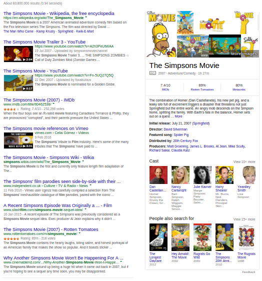

# Google: Parse a Page

A google SERP can contains different type of result.



Firstly they are divided in three distinct regions: natural (organic), paid (adwords) and graph results and each of them
has its own results types.

Through there is a great diversity of results the library gives you the api to work with them, here we explain
what are their differences.

# Natural Results

Natural results (aka organic results) are main results of the page.

Each natural result has a position and some available data. You can access them the following way (see the foreach loop):

```php
    use Serps\SearchEngine\Google\GoogleClient;
    use Serps\SearchEngine\Google\GoogleUrl;

    $googleClient = new GoogleClient($httpClient);

    $googleUrl = new GoogleUrl();
    $google->setSearchTerm('simpsons');

    $response = $googleClient->query($googleUrl);

    $results = $response->getNaturalResults();

    foreach($results as $result){
        // Here we iterate over the result list
        // Each result will have different data based on its type
    }
```

Each of the result from the loop will have the following methods available:

- ``getType()``: the type of the result
- ``is($type)``: check if the result is of the given type
- ``getDataValue($type)``: Get the given data from the result
- ``getData()``: Get the all the data of the result
- ``getOnPagePosition()``: Get the position of the result on the page (not aware of the pagination)
- ``getRealPosition()``: Get the global position of the result (aware of the pagination)

The difference between each result type is the list of data available with ``getDataValue($type)`` and ``getData()``.
See bellow for all available data per result type.


## Natural Result Types

**Result types** can be accessed through the class ``NaturalResultType``,
thus there are 2 ways to compare a result type

```php
    use Serps\SearchEngine\Google\NaturalResultType;

    // 1. compare a single result type
    if($result->is(NaturalResultType::CLASSICAL)){}

    // 2. compare many result types with a switch
    switch($result->getType()){
        case NaturalResultType::CLASSICAL:
            // ...
            break;
        case NaturalResultType::IMAGE_GROUP:
            // ...
            break;
    }
```

From the **resultSet** you can also access all the results matching the given type:

```php

    // Get all the results that are either classical or image_group
    $results = $results->getResultsByType(NaturalResultType::CLASSICAL, NaturalResultType::IMAGE_GROUP);

```


## Classical

These results are the common natural results that have always existed in google.


**Available with**

- ``NaturalResultType::CLASSICAL``

**Data**

- ``title`` <small>**string**</small> [**A**]
- ``url`` <small>**string**</small>: the url targeted on clicking the title
- ``destination`` <small>**string**</small> [**B**]: either a url or a breadcrumb-like destination
- ``description`` <small>**string**</small> [**C**]

**Example**

```php
    use Serps\SearchEngine\Google\NaturalResultType;

    if($result->is(ResultType::CLASSICAL)){
        $title = $result->getData('title');
        $url   = $result->getData('url');
    }
```

## Classical Video

This type of result is very similar with the classical result, but it refers to a video result.

The video result can be illustrated with either a thumbnail or a large image.

These results are the common natural results that have always existed in google.


**Available with**

- ``NaturalResultType::CLASSICAL_VIDEO``

**Data**

- ``title`` <small>**string**</small> [**A**]
- ``url`` <small>**string**</small>: the url targeted on clicking the title
- ``destination`` <small>**string**</small> [**B**]: either a url or a breadcrumb-like destination
- ``description`` <small>**string**</small> [**C**]
- ``videoLarge`` <small>**bool**</small>: true if the video is image is large (usually first result)
- ``videoCover`` <small>**string**</small>: the video picture as given by google (usually a base64 encoded image)

**Example**

```php
    use Serps\SearchEngine\Google\NaturalResultType;

    if($result->is(ResultType::CLASSICAL_VIDEO)){
        $title = $result->getData('title');
        if($result->getData('videoLarge'){
            // ...
        }
    }
```


# Adwords Results


# Related searches